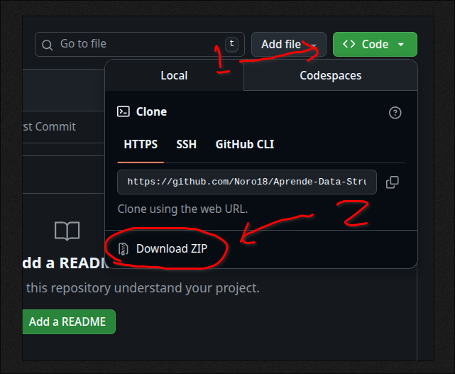

# Repositoriu Estrutura de Dados no Algoritmo

Repository ida ne'e kontem material no problema pratica sira ba iha DSA (Data structure and Algorithm)

## Objetivu husi Repository ida ne'e

1. Aprende DSA bazika
   - Komprende kona ba Estrutura dados basiza
   - Pratika implementasaun 
   - Improve problem solving skills
2. Aprende mos git no github
   - Clone Repositoriu 
   - Halo commit
   - Pull update sira

Enkoraja ita atu halo interasaun ativu ho repositoriu ida ne'e laos le'e deit.

## Oinsa atu uza repositoriu ida ne'e

### Metodo 1 - Clone repositoriu ida ne'e ba ita nia komputador

Cloning ka halo kopia ba ita nia komputador local rasik. 

Kria **folder mamuk** ida no depois run command ida ne'e iha ita nia terminal. Make sure ita nia git installa ona iha ita nia komputador. 

```bash
git clone https://github.com/Noro18/Aprende-Data-Strucutre.git

cd Aprende-Data-Strucutre
```

### Metodo B - Download Repositorio ida ne'e

Karik ita nia git seidauk iha ita bele download direita ho etapa 

1. Click buttuan matak ho label `<> Code`
2. Download ZIP

Bele hare iha imagem kraik: 



